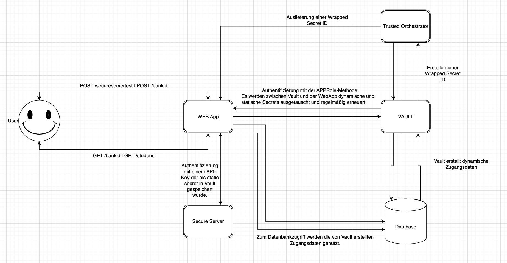

# Vault Sample Application -> Studens Money

Dies ist eine Beispielanwendung, die verschiedene Aspekte der Interaktion mit HashiCorp Vault demonstriert, darunter:

- AppRole authentication mit einem response-wrapping token
- Lesen von static secret von kv-v2 secrets engine
- Lesen von dynamic secret mit PostgreSQL database secrets engine
- Authentication token lease renewal
- Database credentials lease renewal
- Verschlüsseln von Daten mit einem in der kv-v2 secrets engine gespeicherten Schlüssels

## Voraussetzungen

1. docker
1. docker-compose
1. curl to test our endpoints
1. jq _(optional)_ für schönere `JSON` Ausgabe
2. Statt Punkt 3 & 4 kann z.B. auch Postman genutzt werden

## Ausführen

> **Achtung!**: Der Vault-Service ist im Dev-Modus konfiguriert, um ein einfaches Testen zu ermöglichen. 

### 1. Starte die Anwendung

```shell-session
./run.sh
```

```
[+] Running 8/8
 ⠿ Network studens-money-app_default                       Created                                                                                                                                                                                                                                                                                                                                                            0.0s
 ⠿ Volume "studens-money-app_trusted-orchestrator-volume"  Created                                                                                                                                                                                                                                                                                                                                                            0.0s
 ⠿ Container studens-money-app-secure-service-1            Healthy                                                                                                                                                                                                                                                                                                                                                            9.5s
 ⠿ Container studens-money-app-database-1                  Healthy                                                                                                                                                                                                                                                                                                                                                            9.5s
 ⠿ Container studens-money-app-vault-server-1              Healthy                                                                                                                                                                                                                                                                                                                                                            9.4s
 ⠿ Container studens-money-app-trusted-orchestrator-1      Healthy                                                                                                                                                                                                                                                                                                                                                           10.4s
 ⠿ Container studens-money-app-app-1                       Healthy                                                                                                                                                                                                                                                                                                                                                           21.3s
 ⠿ Container studens-money-app-healthy-1                   Started                                                                               0.0s

```

Kontrollieren ob alle Container laufen:

```shell-session
docker ps --format "table {{.Names}}\t{{.Status}}\t{{.Ports}}"
```
Oder in Docker Desktop prüfen.

```
NAMES                                      STATUS                    PORTS
studens-money-app-app-1                    Up 14 seconds (healthy)   0.0.0.0:8080->8080/tcp
studens-money-app-trusted-orchestrator-1   Up 15 seconds (healthy)   
studens-money-app-vault-server-1           Up 22 seconds (healthy)   0.0.0.0:8200->8200/tcp
studens-money-app-secure-service-1         Up 24 seconds (healthy)   0.0.0.0:1717->80/tcp
studens-money-app-database-1               Up 24 seconds (healthy)   0.0.0.0:5432->5432/tcp
```
#### Info Für alle curl Befehle kann stattdessen auch Postman genutzt werden!

### 2. Testen von `POST /secureservertest` endpoint (static secrets)

`POST /secureservertest` ist ein einfaches Beispiel für das Nutzen von statischen Geheimnissen.
Der Service wird eine Anfrage an einen API-Endpunkt eines anderen Dienstes stellen unter Verwendung eines API-Schlüsselwerts,
der in Vault's static secrets engine gespeichert ist.

```shell-session
curl -s -X POST http://localhost:8080/secureservertest | jq
```

```json
{
  "message": "hello world!"
}
```

### 3. Testen von `GET /studens` endpoint (dynamic secrets)

`GET /studens` ist ein einfaches Beispiel für das Nutzen von dynamic secrets.
Der Service verwendet die Vault's static secrets engine zur Erzeugung dynamischer
Datenbankanmeldeinformationen, die dann verwendet werden, um sich mit einer Postgre-SQL-Datenbank anzumelden.

```shell-session
curl -s -X GET http://localhost:8080/studens | jq
```

```json
[
  {
    "id": 1,
    "first_name": "Max",
    "last_name": "Mustermann",
    "email": "mustermann@example.de",
    "phone": "+49 123457"
  },
  {
    "id": 2,
    "first_name": "Thomas",
    "last_name": "Mueller",
    "email": "mueller@example.de",
    "phone": "+49 1234545"
  }
]
```

### 6. Test `GET /bankid / POST /bankid` Verschlüsseln/Entschlüsseln von Daten nach dem Schreiben & Lesen aus der Datenbank

Der Service funktioniert wie in Punkt 3 erläutern, nur dass zusätzlich das IBAN-Feld beim Schreiben in die Datenbank verschlüsselt wird und nach dem Lesen aus der Datenbank entschlüsselt werd, mit einem Schlüssel, der in Vault gespeichert wurde.

Schreiben von neuen Daten:
```shell-session
curl -s -X POST http://localhost:8080/bankid -H "Content-Type: application/json" -d '{ "studentid": "1", "iban": "DE12345678" }'  | jq
```

Lesen von Daten aus der Datenbank:
```shell-session
curl -s -X GET http://localhost:8080/bankid | jq
```

### 5. Kontrollieren der Logs zum prüfen der Renewlogik

Die Schwierigkeiten beim Umgang mit kurzlebigen Secrets besteht darin, dass sie
regelmäßig erneuert werden müssen. Dies gilt auch für Authentifizierungs-Tokens und Datenbank
Datenbankcredentials.

Prüfen die Logs um zu sehen, dass der Vault-Authentifizierungstoken regelmäßig erneuert wird:

```shell-session
docker logs studens-money-app-app-1 2>&1 | grep "LifecycleAwareSessionManager"
```

```log
2023-01-26 15:58:45.264  INFO 1 --- [           main] o.s.v.a.LifecycleAwareSessionManager     : Scheduling Token renewal
2023-01-26 16:00:40.273  INFO 1 --- [TaskScheduler-1] o.s.v.a.LifecycleAwareSessionManager     : Renewing token
2023-01-26 16:00:40.289  INFO 1 --- [TaskScheduler-1] o.s.v.a.LifecycleAwareSessionManager     : Scheduling Token renewal
2023-01-26 16:02:35.298  INFO 1 --- [TaskScheduler-1] o.s.v.a.LifecycleAwareSessionManager     : Renewing token
2023-01-26 16:02:35.318  INFO 1 --- [TaskScheduler-1] o.s.v.a.LifecycleAwareSessionManager     : Scheduling Token renewal
2023-01-26 16:04:30.319  INFO 1 --- [TaskScheduler-1] o.s.v.a.LifecycleAwareSessionManager     : Renewing token
```

Log kontrollieren um den Zyklus zur Erneuerung der Datenbankanmeldeinformationen und der Wiederherstellung der Verbindung zu prüfen:

```shell-session
docker logs studens-money-app-app-1 2>&1 | grep "database/creds/dev-readonly"
```

```log
2022-02-02 21:16:35.737 DEBUG 1 --- [TaskScheduler-1] cretLeaseContainer$LeaseRenewalScheduler : Renewing lease database/creds/readonly /59mGm1fahgzPLo2hBiA3GRtM for secret database/creds/readonly 
2022-02-02 21:16:35.770 DEBUG 1 --- [TaskScheduler-1] o.s.v.core.lease.SecretLeaseContainer    : Secret database/creds/readonly  with Lease database/creds/readonly /59mGm1fahgzPLo2hBiA3GRtM qualified for renewal
2022-02-02 21:16:35.771 DEBUG 1 --- [TaskScheduler-1] cretLeaseContainer$LeaseRenewalScheduler : Scheduling renewal for secret database/creds/readonly  with lease database/creds/readonly /59mGm1fahgzPLo2hBiA3GRtM, lease duration 60
```

### 6. Stoppe die Anwendung

```shell-session
./stop.sh
```
```
[+] Running 6/6
 ⠿ Container studens-money-app-healthy-1               Stopped                                                                                                                                          0.0s
 ⠿ Container studens-money-app-app-1                   Stopped                                                                                                                                          0.0s
 ⠿ Container studens-money-app-trusted-orchestrator-1  Stopped                                                                                                                                          0.1s
 ⠿ Container studens-money-app-secure-service-1        Stopped                                                                                                                                          0.1s
 ⠿ Container studens-money-app-vault-server-1          Stopped                                                                                                                                          0.1s
 ⠿ Container studens-money-app-database-1              Stopped                                                                                                                                          0.2s

```
## Stack Design

### API

| Endpoint                     | Description                                                                                                                                                                   |
|------------------------------|-------------------------------------------------------------------------------------------------------------------------------------------------------------------------------|
| **POST** `/secureservertest` | Ein Beispiel zur nutzung von Vault static secrets.                                                                                                                            |
| **GET** `/studens`           | Ein Beispiel zu nutzung von  Vault dynamic secrets.                                                                                                                           |
| **GET** `/bankid`            | Ein Beispiel zu nutzung von  Vault dynamic secrets und der Entschlüsselung von einer IBAN mit der Hilfe von einem Schlüssel der als static secret in Vault gespeichert wurde. |
| **Post** `/bankid`           | Ein Beispiel zu nutzung von  Vault dynamic secrets und der Verschlüsselung von einer IBAN mit der Hilfe von einem Schlüssel der als static secret in Vault gespeichert wurde. |


### Docker Compose Architecture




